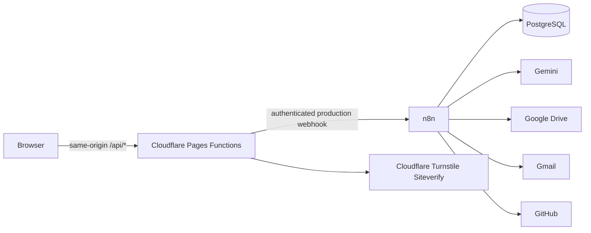

# AdFlow AI

AdFlow AI is a self-hosted n8n automation system for a fictional
Meta Ads agency.

It automates:

- Client campaign intake
- PostgreSQL data tracking
- AI campaign strategy and ad generation
- Structured JSON validation
- Human approval and revision loops
- Version-controlled campaign outputs
- Production-task creation
- GitHub Issue synchronization
- Google Drive delivery
- Workflow error reporting
- Background-job recovery
- MCP tools for AI agents

## Technology

- n8n Community Edition
- Docker Compose
- PostgreSQL
- Gemini API
- GitHub
- Google Drive
- Gmail
- JavaScript
- SQL
- MCP

## Workflow sequence

Client Brief → Validation → Database → AI Generation → Human Review
→ Revision or Approval → Production Tasks → GitHub and Drive Delivery

## Safety and reliability

The workflow does not automatically publish advertisements.
Every AI package requires human approval before entering production.

The repository contains no API keys or passwords.
All demonstration client information is fictional.

## Running locally

1. Copy `.env.example` to `.env`.
2. Replace placeholder values.
3. Start Docker Desktop.
4. Run:

   docker compose up -d

5. Open:

   http://localhost:5678

## AdFlow Studio website

The client-facing React and Cloudflare Pages application lives in
`apps/web`. It adds a public agency site, structured campaign brief,
secure status portal, and secure human-review page without changing the
existing n8n, PostgreSQL, Docker, workflow, or documentation assets.



From `apps/web`:

```bash
npm install
npm run dev
npm run dev:cloudflare
npm run typecheck
npm run lint
npm run test:run
npm run build
```

Cloudflare Pages uses `apps/web` as its root directory, `npm run build`
as its build command, and `dist` as its output directory. See
`apps/web/CLOUDFLARE_SETUP.md` for the complete binding and deployment
contract.

### No-secret policy

The browser never calls n8n directly. n8n webhook URLs,
`N8N_API_KEY`, and `TURNSTILE_SECRET_KEY` are server-only Cloudflare
bindings and must never appear in a `VITE_` variable. Portal and review
tokens are not stored in analytics or `localStorage`. Do not edit or
reuse the repository root `.env` for the website.
