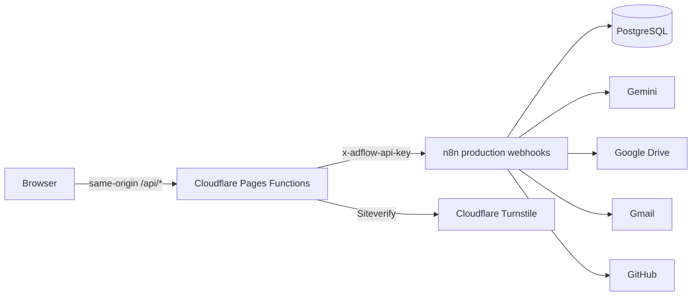

# AdFlow Studio web

AdFlow Studio is the client-facing React application for the AdFlow AI automation system. It provides public agency pages, a five-step campaign brief, a secure client portal, a secure review page, and same-origin Cloudflare Pages Functions that proxy requests to authenticated n8n production webhooks.

> AI-assisted ad strategy. Human-reviewed creative production.

The website does not publish ads, spend advertising budget, promise results, or expose n8n webhook URLs to the browser.

## Architecture



The browser receives only client-safe API responses. `N8N_API_KEY`, webhook URLs, and `TURNSTILE_SECRET_KEY` exist only as Cloudflare server-side bindings. Portal and review tokens are used only in secure URLs and API requests; the application does not put them in analytics, `localStorage`, or console logs.

## Routes

- `/` — homepage
- `/services` — services and deliverables
- `/how-it-works` — automated and human process timeline
- `/example-campaign` — fictional FreshWeek Meals demonstration
- `/start-campaign` — five-step campaign brief
- `/campaign/:campaignCode?token=...` — secure campaign status portal
- `/review/:token` — secure campaign review and decision page
- `/privacy`, `/terms`, `/contact` — legal and contact pages

## Local development

From `apps/web`:

```bash
npm install
copy .env.example .env.local
copy .dev.vars.example .dev.vars
npm run dev
```

Use `npm run dev` for frontend-only development. API requests require Cloudflare Pages Functions, so use this command for the integrated application:

```bash
npm run dev:cloudflare
```

The integrated command builds the app and starts `npx wrangler pages dev dist`. Use the URL Wrangler prints.

## Mock mode

Set `VITE_USE_MOCK_API=true` in `.env.local`, then run `npm run dev`. All routes stay navigable, and the form, portal, review, and contact experiences use clearly labeled local demonstration fixtures from `src/mocks`. Mock mode does not call n8n and is disabled by default in `.env.example`.

Useful demonstration links:

- `/campaign/CMP-DEMO-FRESHWEEK?token=demo-portal-token`
- `/review/demo-review-token`

## Quality commands

```bash
npm run typecheck
npm run lint
npm run test
npm run test:run
npm run format
npm run format:check
npm run build
npm run preview
```

## Environment files

- `.env.local` — public Vite build variables for local development. Never put private keys here or in any `VITE_` variable.
- `.dev.vars` — local server-only Pages Function bindings. This file is ignored by Git.
- `.env.example` and `.dev.vars.example` — placeholder-only templates safe to commit.

See [CLOUDFLARE_SETUP.md](./CLOUDFLARE_SETUP.md) for exact deployment fields and [API_CONTRACT.md](./API_CONTRACT.md) for request and response shapes.
